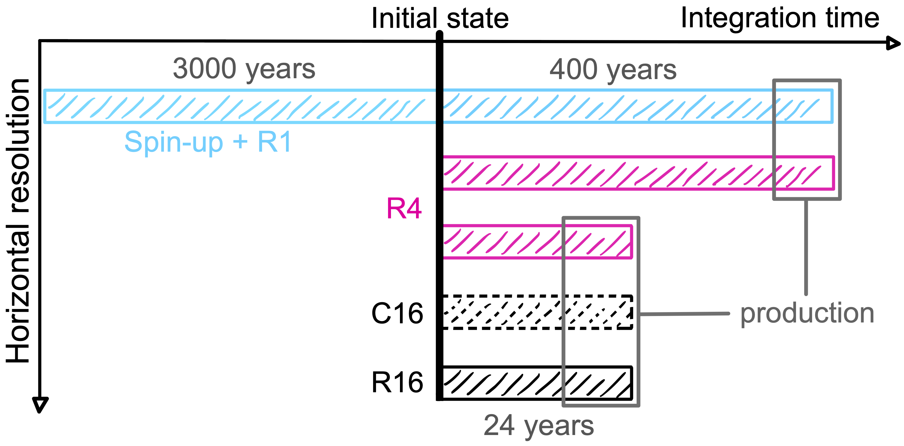

# DINO
A DIabatic Neverworld Ocean in NEMO 4.2.1. This repository contains the source code for the NEMO test configuration `DINO` and reference experiments for 1°, 1/4° and 1/16° horizontal resolution. A short summary of the configuration details can be found in [this Python class](https://github.com/vopikamm/dinostics/blob/7f776460128afb2af9153aab06af70e4aad152b7/dino_configuration.py) with some visualizations in [this jupyter notebook](https://github.com/vopikamm/dinostics/blob/7f776460128afb2af9153aab06af70e4aad152b7/DINO_config.ipynb). A more elaborate description of the configuration is currently in review.

## Content
* /EXP_R1:  1°    reference experiment
* /EXP_R4:  1/4°  reference experiment
* /EXP_R16: 1/16° reference experiment
* /EXPREF:  1°    spin-up from scratch
* /MY_SRC:  source files
* /cpp_DINO.fcm   keys for compilation       

## Installation
Please follow the [NEMO installation guide](https://sites.nemo-ocean.io/user-guide/install.html#essential-components) and install XIOS and NEMO [version 4.2.1](https://forge.nemo-ocean.eu/nemo/nemo/-/releases/4.2.1) (!) as described. If you are new to NEMO I suggest following the guide until you manage to run your own [test configuration](https://sites.nemo-ocean.io/user-guide/install.html#running-the-model) before continuing with DINO.

### Downloading necessary code/data

Go into the `tests` folder of your NEMO installation and clone the repository:

```
cd <YOUR_NEMO_INSTALLATION>/tests
git clone https://github.com/vopikamm/DINO.git
```

If you plan to reproduce the reference experiments, please use the **zenodo release**. This archive includes restart files, Evaporation-Precipitation forcing fields (emp) and namelists to reproduce the 1° (R1), 1/4° (R4) and 1/16° (R16) experiments, both from the `initial state` (init) or just from the last few years of `data production` (prod), as indicated in the spin-up strategy:



### Compilation 

First you need to add `DINO` to the configuration list in `demo_cfgs.txt`:

```
echo "DINO  OCE" >> ../demo_cfgs.txt
```

Now compile from the NEMO root directory, e.g.:

```
./makenemo -n 'DINO_compiled' -a 'DINO' -m '<YOUR_ARCH_FILE>' -j 32
```
This will compile DINO into a new folder `/DINO_compiled` add another new folder `/EXP00` inside, which contains the reference experiment `/EXPREF` and a symbolic link to the excecutable `nemo.exe`.

### Build your experiment
Choose the experiment you want to run and if you want to run it from the `initial` or `production` restart file. Go into its folder and rename the respective namelist file, e.g for EXP_R1 from init: 

```
cd tests/DINO_compiled/EXP_R1
mv namelist_cfg_init namelist_cfg
```

Copy all necessary files from `EXP00` (**without overwriting** the output definition file and the `namelist_cfg`!):

```
cp -an ../EXP00/. ./
```

### Run the experiment:
As for the [NEMO installation guide](https://sites.nemo-ocean.io/user-guide/install.html#running-the-model) you can run the experiment (Here in detached mode on 37 CPUs):

```
mpirun -np 36 ./nemo : -np 1 <path_to_your>/xios_server.exe
```

## Additional notes:
* NEMO stores the runtime in seconds. Therefore you cannot run DINO for more than 2.^31 / 24. /3600 ./ 360. = 69.04 to store such large numbers with integer 4. For this reason and not obtaining too large output files we suggest to run DINO in batches of 50 years (R1), 10 years (R4) and 1 year (R16) restarts.
* The computational ressources vary from machine to machine and depend on the level of parallelisation. But for reference, here are some rough estimates from my experiments on the Jean Zay HPC:
    - R1:  on 36 + 1   CPUs  ~ 2    hCPU / simulated year
    - R4:  on 585 + 15  CPUs  ~ 120  hCPU / simulated year
    - R16: on 4368 + 112 CPUs  ~ 9000 hCPU / simulated year
* All above was written for NEMO/XIOS in detached mode, where one CPU per computing node was reserved for XIOS. This is advised for efficient input/output reading/writing.
