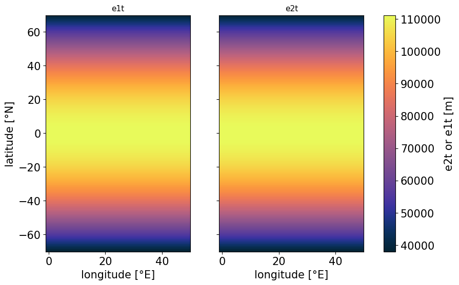
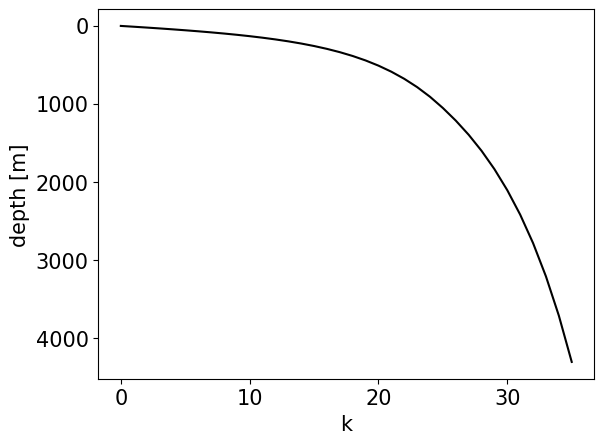
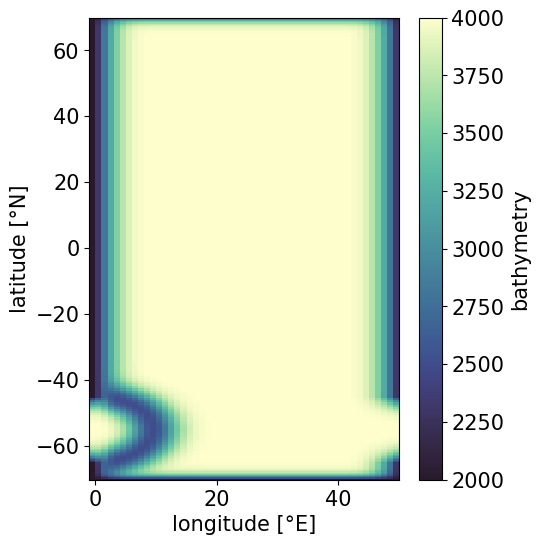
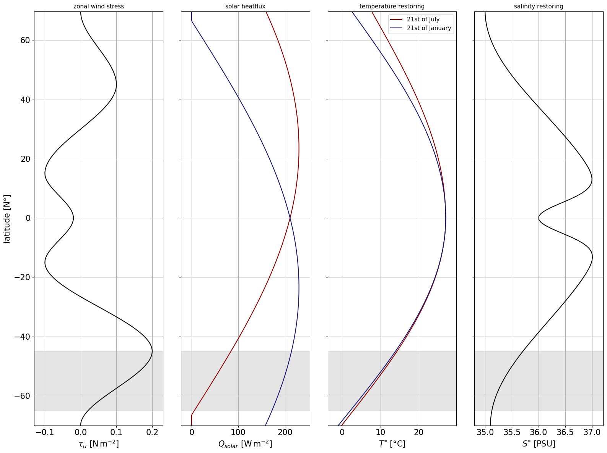

# DINO configuration
A DIabatic NeverwOrld2 in NEMO. This repository contains the source for the NEMO configurartion DINO.
## Grid

### Horizontal discretization
DINO is solved on a sphere and discretized by a horizontally isotropic mercator grid. Therefore, the grid-spacing in latitudinal direction decreases towards the poles.

We compute **longitude at T-points** as
$$
\begin{equation*}
    \lambda(i) = \lambda_{0} + \Delta \lambda * i
\end{equation*}
$$

where $i \in \left[ 1, I \right]$
and **latitude at T-points** as
$$
\begin{equation*}
    \phi(j) = \frac{180}{\pi} * \arcsin ( \tanh( \Delta \lambda \frac{\pi}{180} * j) )
\end{equation*}
$$

where $j \in \left[ 1, J \right]$. \
The prognostic variables are staggered on an Arakawa C-grid. $I$ and $J$ are chosen to span a domain of 50° from eastern to western boundary and approximately 70° (not exactly, due to the mercator projection in (2)) from equator to both northern and southern boundary. In the following we show an example of the resulting grid spacing along $y$ (e2t) and $x$ (e1t) in meters for $\Delta \lambda = 1.0$:
    

    
### Vertical discretization
Since this [commit](https://github.com/vopikamm/DINO/commit/084122893073255b154f7fba188f7683ea80331a) DINO has the option for a full step z* vertical coordinate. It follows exactly the same stretching function as the hybrid sigma-z coordinate, but assuming a flat bottom: \
With
$$
    \begin{align*}
    a_0 &= \left( dz_{min} - \frac{H - h_{co}}{K - 1 - k_{const}}\right)/
              \left(\tanh{\left(\frac{1 - k_{th}}{a_{cr}}\right)} - a_{cr} \cdot \frac{\ln{\left( \cosh{\left(\frac{K - k_{const} - k_{th}}{a_{cr}}\right)}\right)} - \ln{\left(\cosh{\left(\frac{1 - k_{th}}{a_{cr}}\right)}\right)}}{K - 1 - k_{const}}\right) \\
   a_1 &= dz_{min} - a_0 \cdot \tanh{\left(\frac{1 - k_{th}}{a_{cr}}\right)} \\

   a_2 &= -a_1 - a_0 \cdot a_{cr} \cdot \ln{\left(\cosh{\left(\frac{1 - k_{th}}{a_{cr}}\right)}\right)}

    \end{align*}
$$

We compute the **depth at T-points**
$$
    z_t = a_2 + a_1 \cdot k_t + a_0 \cdot a_{cr} \cdot \ln{\left(\cosh{\left(\frac{k_w - k_{th}}{a_{cr}}\right)}\right)} + h_{co},
    $$
where

$$  k_t = k - k_{const} + 0.5 $$

and **depth at W-points**
$$
   z_w = a_2 + a_1 \cdot k_w + a_0 \cdot a_{cr} \cdot \ln{\left(\cosh{\left(\frac{k_t - k_{th}}{a_{cr}}\right)}\right)} + h_{co},
$$

where

$$  k_w = k - k_{const} $$ 

This is done once for the top z-level using the parameters
$$
    \begin{align*}
        &H = 4000 &&: \text{Depth of the bottom [meters]} \\
        &dz_{min} = 10 &&: \text{Value of e3 at the connection point [meters]} \\
        &h_{co} = 0 &&: \text{Depth of the connection between z- and s-coordinat es [meters]} \\
        &k_{th} = 35 &&: \text{Position of the inflexion point} \\
        &k_{const} = 0 &&: \text{Index of last level with z-coordinates} \\
        &a_{cr} = 10.5 &&: \text{Slope of the tanh function},
    \end{align*}
$$

and then repeated for the bottom "sigma"-level with adapted diagnosed parameters

$$
    \begin{align*}
        &k_{const} &&= argmin(abs(z_w - 1000m) &&: \text{Index of last level with z-coordinates} \\
        &dz_{min} &&= diff(z_t)[k_{const}] &&: \text{Value of e3 at the connection point [meters]} \\
        &h_{co} &&= z_w[k_{const}] &&: \text{Depth of the connection between z- and s-coordinat es [meters]} \\
    \end{align*}
$$

The vertical index $k \in \left[ 1, K \right]$ with $K=36$.
The resulting depth level over k are shown in the following:
    

    

## Bathymetry
The domain is closed everywhere except a periodic re-entrant channel between $45°S$ and $65°S$. Above $2000m$ depth the domain is bounded by vertical walls, below a tapered exponential defines the slopes. A semi-circular sill with a Gaussian shape introduces a pressure gradient in the channel, similar to the Neverworld2 configuration. The exact implementation is demonstrated in `DinoConfiguration.get_bathymetry()` and `DinoConfiguration.add_gaussian_ring()`. In the following we show the resulting bathymetry for the standard configuration:   

    

    

## Equation of State (EOS)
We follow the simplified EOS from [Roquet et al. (2015)](https://doi.org/10.1175/JPO-D-15-0080.1)

$$
\begin{equation*}
    \rho(T,S,p) = \rho_{0} - \left( 
        a_{0} + 
        \frac{1}{2} C_{b} T_{a} +
        T_{h} p 
        \right) T_{a} + b_{0} S_{a}
\end{equation*}
$$

where 
$$
\begin{align*}
T_{a} &= T - 10°C \\
S_{a} &= S - 35 \, \text{g} \, \text{kg}^{-1}
\end{align*}
$$

using the parameters:

$$
\begin{align*}
    &\rho_{0} = 1028 &&: \text{reference density } [\text{kg} \, \text{m}^{-3}] \\
    &a_{0} = 0.1655 &&: \text{thermal expansion } [\text{kg} \, \text{m}^{-3} \, \text{K}^{-1}] \\
    &b_{0} = 0.7655 &&: \text{haline expansion  } [\text{kg}^{2} \, \text{m}^{-3} \, \text{g}^{-1}] \\
    &C_{b} = 9.9 \times 10^{-3} &&: \text{thermal cabbeling } [\text{kg} \, \text{m}^{-3} \, \text{K}^{-2}] \\
    &T_{h} = 2.4775 \times 10^{-5} &&: \text{thermobaricity } [\text{kg}^{-3} \, \text{dbar}^{-1} \, \text{K}^{-1}]
\end{align*}
$$

## Surface Boundary Conditions

We need to define surface boundary conditions for all prognostic variables, namely $U$, $V$, $T$,  and $S$. Regarding momentum we follow [Marques et al 2020](https://doi.org/10.5194/gmd-15-6567-2022) with a purely zonal wind stress profile constructed with a piecewise cubic interpolation between fixed values of latitude.

 Temperature $T$ and salinity $S$ are restored towards meridional profiles, defined through

$$
    T^{*}(\phi) = T^{*}_{n/s} + \left( T^{*}_{eq} - T^{*}_{n/s} \right) \, \sin(\pi \, \frac{\phi + \phi_n}{\phi_n - \phi_s})
$$

and

$$
    S^{*}(\phi) = S^{*}_{n/s} + \left( S^{*}_{eq} - S^{*}_{n/s} \right) \, \left(1 + \cos(\frac{2 \, \pi \, \phi }{\phi_n - \phi_s})\right) / 2 - 1.25 \, e^{- \phi^{2} / 7.5^{2}}
$$

where the subscript $(...)_{n/s}$ denotes the value at the northern or southern boundary, when $\phi < 0$ or $\phi > 0$.
The restoring values for southern, northern boundary and equator are 

$$
\begin{align*}
    &T^{*}_{s} = -0.5°C, &&T^{*}_{n} = -5.0°C, &&T^{*}_{eq} = 27.0°C \\
    &S^{*}_{s} = 35.1 PSU, &&S^{*}_{n} = 35.0 PSU, &&S^{*}_{eq} = 37.25 PSU \\
\end{align*}.
$$

The salinity restoring stays constant throughout the simulation, while a seasonal cosine of magnitude $3.0°C$ (at $T^{*}_{n}$) and $0.5°C$ (at $T^{*}_{s}$) is applied to the boundary values of the temperature restoring. The maximum/minimum restoring lags one month after the respective minimum/maximum in solar radiation. All meridional profiles of surface boundary conditions are visualized below. 

Shortwave solar radiation is adapted from [Caneill et al. 2022](https://doi.org/10.1175/JPO-D-21-0295.1) and given by

$$
Q_{solar}(\phi) = 230. \, \cos\left( \frac{\pi}{180} \, \left[ \phi - 23.5 \, \cos(\pi \,\frac{d+189}{180})\right]\right)
$$

where d is the day of the year controlling a seasonal cycle in the solar forcing.
    

