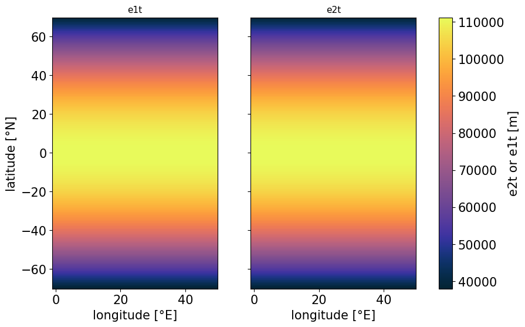
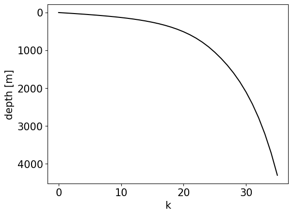
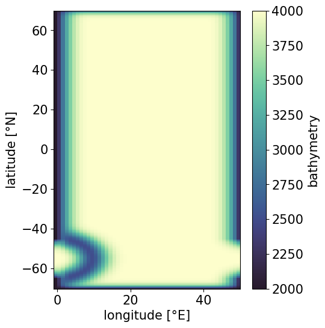
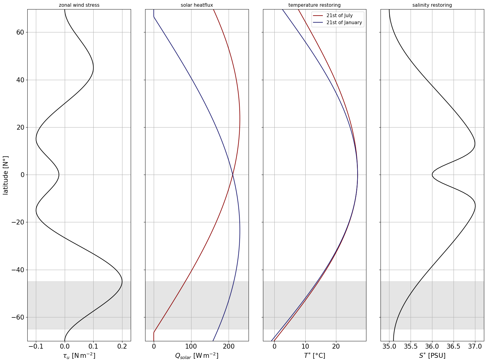

**DINO Demonstrator for NEMO 5.0.1**
This demonstrator was developed during the NEMO Zoo hackathon hosted by the 2025 NEMO Party in Exeter. It describes the general motivation behind the DINO configuration and gives instructions on how to install, compile and run it with [**NEMO v5.0.1**](https://forge.nemo-ocean.eu/nemo/nemo/-/releases/5.0.1). 

# DINO [](https://doi.org/10.5281/zenodo.15016824)

## 1. The DINO configuration

### Motivation
The configuration is an idealized Atlantic sector model, designed as a testbed for mesoscale eddy parameterizations. It captures key features of our climate system, like the Antarctic Circumpolar Current (ACC), Meridional Overturning Circulation (MOC) and their associated transports, while being cheap enough to be run across a hierarchy of horizontal resolutions from 1° to 1/16°. The basin domain is broadly based on Neverworld2 by [Marques et al. (2022)](https://doi.org/10.5194/gmd-15-6567-2022), but the model accounts for diabatic processes such as convection, diapycnal mixing, and dense water formation.
Here we will give a short introduction into the configuration and a short tutorial on how to get it started. All components of the configuration are also implemented as a Python class showcased in this Jupyter notebook (TODO link). 

### Horizontal discretization
DINO is solved on a sphere and discretized by a horizontally isotropic mercator grid. Therefore, the grid-spacing in latitudinal direction decreases towards the poles. The **longitude at T-points** is computed as

$$
\begin{equation*}
    \lambda(i) = \lambda\_{0} + \Delta \lambda  i
\end{equation*}
$$

where $i = 1, \ldots, I$
and **latitude at T-points** as

$$
\begin{equation*}
    \phi(j) = \frac{180}{\pi}  \arcsin ( \tanh( \Delta \lambda \frac{\pi}{180}  j) )
\end{equation*}
$$

where $j = 1, \ldots, J$.

The prognostic variables are staggered on an Arakawa C-grid. $I$ and $J$ are chosen to span a domain of 50° from eastern to western boundary and approximately 70° (not exactly, due to the mercator projection in (2)) from equator to both northern and southern boundary (`rn_phi_min = = -70`, `rn_phi_max = = 70`, `rn_lam_min = = 0`, `rn_lam_max = = 50`). In the following we show an example of the resulting grid spacing along $y$ (`e2t`) and $x$ (`e1t`) in meters for $\Delta \lambda = 1.0$ (`rn_e1_deg = 1.0`):
    

    
### Vertical discretization
DINO has the option for a full step z or hybrid sigma-z vertical coordinate (`ln_zco_nam` or `ln_sco_nam`). The exact analytical formulation is described in Appendix C of [Kamm et al. (2025)](https://doi.org/10.5194/egusphere-2025-1100), but the default vertical levels at **T-points** for `nn_k = 36` are shown below.




### Bathymetry
The domain is closed everywhere except a periodic re-entrant channel between 45°S and 65°S. Above 2000m depth the domain is bounded by vertical walls, below a tapered exponential defines the slopes. A semi-circular sill with a Gaussian shape introduces a pressure gradient in the channel, similar to the Neverworld2 configuration. The exact implementation is demonstrated in `DinoConfiguration.get_bathymetry()` and `DinoConfiguration.add_gaussian_ring()` of `dino_configuration.py`. The resulting bathymetry for the standard configuration is shown here:   



    

### Equation of State (EOS)
We follow the simplified EOS from [Roquet et al. (2015)](https://doi.org/10.1175/JPO-D-15-0080.1)

$$
\begin{equation*}
    \rho(T,S,p) = \rho_{0} - \left( 
        a_{0} + 
        \frac{1}{2} C_{b} T_{a} +
        T_{h} p 
        \right) T_{a} + b_{0} S_{a}
\end{equation*}
$$

where 

$$
\begin{align*}
T_{a} &= T - 10°  C \\
S_{a} &= S - 35  \text{g} \text{kg}^{-1}
\end{align*}
$$

using the parameters (changeable in `&nameos`):

$$
\begin{align*}
    &\rho_{0} = 1028 &&: \text{reference density } [\text{kg}  \text{m}^{-3}] \\
    &a_{0} = 0.1655 &&: \text{thermal expansion } [\text{kg}  \text{m}^{-3}  \text{K}^{-1}] \\
    &b_{0} = 0.7655 &&: \text{haline expansion  } [\text{kg}^{2} \text{m}^{-3}  \text{g}^{-1}] \\
    &C_{b} = 9.9 \times 10^{-3} &&: \text{thermal cabbeling } [\text{kg} \text{m}^{-3}  \text{K}^{-2}] \\
    &T_{h} = 2.4775 \times 10^{-5} &&: \text{thermobaricity } [\text{kg}^{-3}  \text{dbar}^{-1}  \text{K}^{-1}]
\end{align*}
$$


### Surface Boundary Conditions

The surface boundary conditions are defined for all prognostic variables, namely U, $V$, $T$,  and $S$. Regarding momentum they are as in [Marques et al. (2020)](https://doi.org/10.5194/gmd-15-6567-2022) with a purely zonal wind stress profile constructed with a piecewise cubic interpolation between fixed values of latitude. Temperature $T$ and salinity $S$ are restored to profiles adapted from [Munday et al. (2012)](https://doi.org/10.1175/JPO-D-12-095.1). The salinity restoring stays constant throughout the simulation, while a seasonal cosine of magnitude $3.0°C$ and $0.5°C$ is applied to the northern and southern boundary values of the temperature restoring. The maximum/minimum restoring lags one month after the respective minimum/maximum in solar radiation. Shortwave solar radiation is adapted from [Caneill et al. (2022)](https://doi.org/10.1175/JPO-D-21-0295.1). The analytical expression of all profiles are provided in [Kamm et al. (2025)](https://doi.org/10.5194/egusphere-2025-1100) and visualized below.



## 2. Getting started :rocket:
First you need to install a working version of NEMO and XIOS on your machine. For a detailed guide we refer to the [NEMO installation guide](https://sites.nemo-ocean.io/user-guide/install.html#essential-components), but here are the essential steps.

Ensure you have the necessary fortran compilers and MPI versions installed or loaded as modules. These will depend on the machine you are using, but here is a working example at the time of writing this necessary on the [Jean Zay](http://www.idris.fr/eng/info/missions-eng.html) computer:

```
  module load intel-compilers/19.1.3
  module load intel-mpi/2019.9
  module load hdf5/1.12.0-mpi
  module load netcdf-c/4.7.4-mpi
  module load netcdf-fortran/4.5.3-mpi
  module load svn/1.9.7 
```
### XIOS
Then checkout the XIOS trunk (here XIOS2)

```
svn co http://forge.ipsl.jussieu.fr/ioserver/svn/XIOS2/trunk
```

go into the XIOS directory and compile it with the arch file for your machine

```
cd trunk
./make_xios --arch <YOUR_ARCH_FILE> --full --prod --job 8
```

### NEMO
Go back to your Clone and checkout the NEMO `v5.0.1` release

```
cd ../
git clone --branch 5.0.1 https://forge.nemo-ocean.eu/nemo/nemo.git nemo_5.0.1
```
In your arch file you will need to add your full `<PATH_TO_YOUR_XIOS>/trunk` as `XIOS_HOME`. There it should look something like 

```
%XIOS_HOME           `<PATH_TO_XIOS>/trunk`
```

### DINO
Go into the `tests` folder of your NEMO installation and clone the `wip/DINO_5.0.1` branch of the repository:

```
cd <YOUR_NEMO_INSTALLATION_PATH>/tests
git clone -b wip/DINO_5.0.1 https://github.com/vopikamm/DINO.git
```

### Compilation 

First you need to add `DINO` to the configuration list in `tests/demo_cfgs.txt`:

```
echo "DINO  OCE" >> ./demo_cfgs.txt
```
If you chose to rename the configuration folder, replace `"DINO  OCE"` with `"<YOUR_NAME>  OCE"` and also rename the file `cpp_DINO.fcm` to `cpp_<YOUR_NAME>.fcm`. 
Now compile from the NEMO root directory, e.g.:

``` 
../makenemo -n 'DINO_compiled' -a 'DINO' -m '<YOUR_ARCH_FILE>' -j 8
```

This will compile DINO into a new folder `/DINO_compiled` add another new folder `/EXP00` inside, which contains a symbolic link to the excecutable `nemo.exe`. This experiment corresponds to running DINO at 1° from scratch.

### Run the experiment:
As for the [NEMO installation guide](https://sites.nemo-ocean.io/user-guide/install.html#running-the-model) you can run the experiment (Here in detached mode on 37 CPUs):

```
mpirun -np 36 ./nemo : -np 1 <PATH_TO_YOUR>/xios_server.exe
```

## 3. Look at your output


## 4. References

Kamm, D., Deshayes, J., & Madec, G. (2025). DINO: A Diabatic Model of Pole-to-Pole Ocean Dynamics to Assess Subgrid Parameterizations across Horizontal Scales. EGUsphere, 2025, 1-26.

Marques, G. M., Loose, N., Yankovsky, E., Steinberg, J. M., Chang, C. Y., Bhamidipati, N., ... & Zanna, L. (2022). NeverWorld2: An idealized model hierarchy to investigate ocean mesoscale eddies across resolutions. Geoscientific Model Development, 15(17), 6567-6579.

Munday, D. R., Johnson, H. L., & Marshall, D. P. (2013). Eddy saturation of equilibrated circumpolar currents. Journal of Physical Oceanography, 43(3), 507-532.

Caneill, R., Roquet, F., Madec, G., & Nycander, J. (2022). The polar transition from alpha to beta regions set by a surface buoyancy flux inversion. Journal of Physical Oceanography, 52(8), 1887-1902.

Roquet, F., Madec, G., Brodeau, L., & Nycander, J. (2015). Defining a simplified yet “realistic” equation of state for seawater. Journal of Physical Oceanography, 45(10), 2564-2579.

## 5. How to cite

If you use this configuration, please use the model description paper [Kamm et al. (2025)](https://doi.org/10.5194/egusphere-2025-1100).

## Additional notes:
* NEMO stores the runtime in seconds. Therefore you cannot run DINO for more than 2.^31 / 24. /3600 ./ 360. = 69.04 to store such large numbers with integer 4. For this reason and not obtaining too large output files we suggest to run DINO in batches of 50 years (R1), 10 years (R4) and 1 year (R16) restarts.
* The computational ressources vary from machine to machine and depend on the level of parallelisation. But for reference, here are some rough estimates from my experiments with NEMO 4.2.1 on the Jean Zay HPC (They should roughly double in performance with the RK3 scheme of NEMO 5.0.1):
    - R1:  on 36 + 1   CPUs  ~ 2    hCPU / simulated year
    - R4:  on 585 + 15  CPUs  ~ 120  hCPU / simulated year
    - R16: on 4368 + 112 CPUs  ~ 9000 hCPU / simulated year
* All above was written for NEMO/XIOS in detached mode, where one CPU per computing node was reserved for XIOS. This is advised for efficient input/output reading/writing of large configurations.


